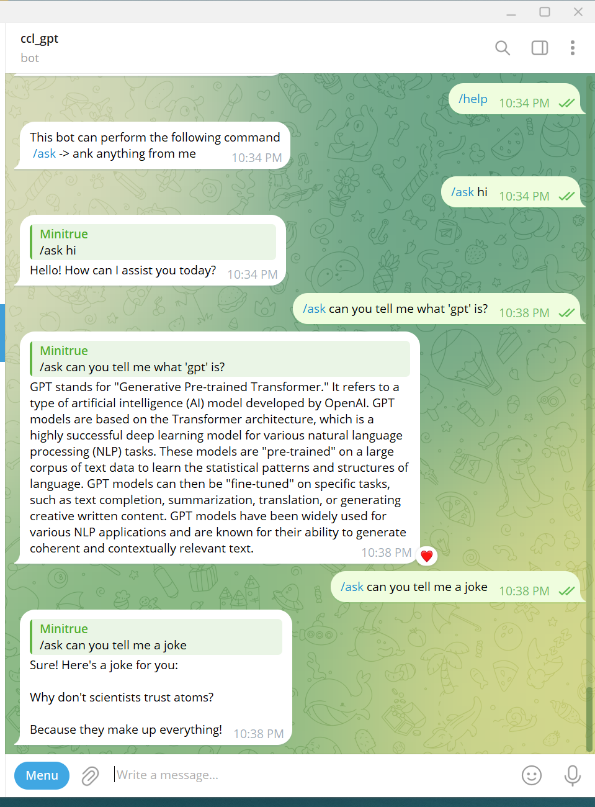

# ChatGPT-Telegram-Bot

## Usage

## How To Install 
1. Install node js

   v16.0 or higher

2. Init dependency

   npm install

3. Edit config file (.env)

   add TELEGRAM token and OPENAI token

4. Run the bot

   node index.js
